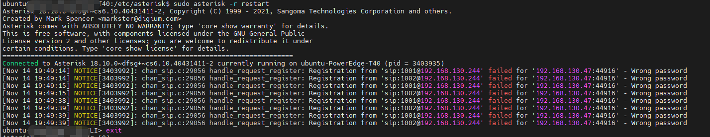

## gui配置asterisk工具FreePBX

[Ubuntu18.04 安装Asterisk16.10 + FreePBX15.0](https://smart-ryan.blog.csdn.net/article/details/106888124?spm=1001.2101.3001.6650.1&utm_medium=distribute.pc_relevant.none-task-blog-2%7Edefault%7EBlogCommendFromBaidu%7ERate-1-106888124-blog-82598287.pc_relevant_vip_default&depth_1-utm_source=distribute.pc_relevant.none-task-blog-2%7Edefault%7EBlogCommendFromBaidu%7ERate-1-106888124-blog-82598287.pc_relevant_vip_default&utm_relevant_index=2)

[利用Linphone测试本地（虚拟机+真机）Asterisk的sip服务](https://blog.csdn.net/u010148712/article/details/53244000)  //当前所用

[Asterisk的配置详解](https://www.cnblogs.com/lr393993507/p/5309913.html)

## ubuntu 下安装sip服务端asterisk

```c
apt-get install asterisk
```

配置文件

> /etc/asterisk


启动服务

> sudo service asterisk stop


进入asterisk命令行

> sudo asterisk -r restart



### [控制台常用命令：](https://blog.csdn.net/neojan/article/details/82598287?utm_medium=distribute.pc_relevant.none-task-blog-2~default~baidujs_baidulandingword~default-2-82598287-blog-115908159.pc_relevant_vip_default&spm=1001.2101.3001.4242.2&utm_relevant_index=5)

查看用户:

>sip show users

每次修改sip.conf后可以使用下面命令重新加载

> sip reload

每次修改extension.conf文件后可以使用下面命令重新加载

> dialplan reload