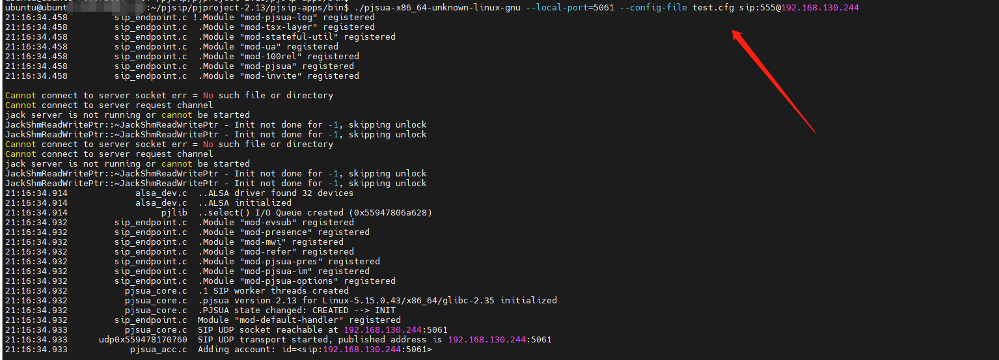

## 踩坑记录

### 问题提示

>  pjsua_core.c  bind() error: Address already in use [status=120098]

### 解决办法：

> ./pjsip-apps/bin/pjsua-x86_64-unknown-linux-gnu --local-port=5061

### 参考文章：

[pjsua_core.c bind()error: Address already in use Crash help ?](https://www.spinics.net/lists/pjsip/msg04248.html)

### [拔号操作：](https://www.spinics.net/lists/pjsip/msg20671.html)

 拨打555用户，本机号为315

> cd /home/ubuntu/pjsip/pjproject-2.13/pjsip-apps/bin
>
> ./pjsua-x86_64-unknown-linux-gnu --local-port=5061 --config-file test.cfg sip:555@192.168.130.244

本机315的配置文件：

> --id sip:315@192.168.130.244
> --registrar sip:192.168.130.244:5060
> --realm *
> --username 315
> --password pw315
> --null-audio

实例截图：

ps:需要555同时在线