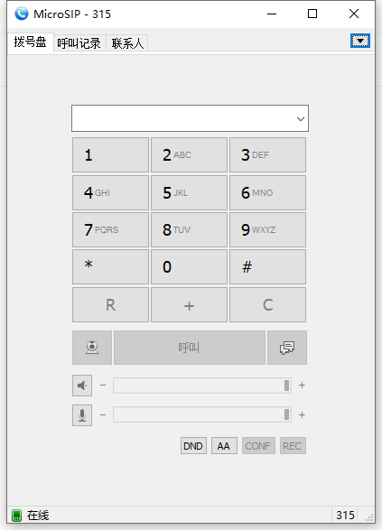

# sip客户端

## [pjsip](https://www.pjsip.org/about.htm#opensource)（开源库）

[pjsip小结](https://blog.csdn.net/MR_DUAN1105/article/details/97618982)

[玩转pjsip之一 简介](https://blog.csdn.net/kai157346113/article/details/80806137?spm=1001.2101.3001.6650.6&utm_medium=distribute.pc_relevant.none-task-blog-2%7Edefault%7EBlogCommendFromBaidu%7ERate-6-80806137-blog-97618982.pc_relevant_recovery_v2&depth_1-utm_source=distribute.pc_relevant.none-task-blog-2%7Edefault%7EBlogCommendFromBaidu%7ERate-6-80806137-blog-97618982.pc_relevant_recovery_v2&utm_relevant_index=11)

[镜像下载](https://gitee.com/mirrors/pjsip?utm_source=alading&utm_campaign=repo)

[github地址](https://github.com/pjsip/pjproject)

[Linux系统下pjsip/pjsua的安装（已测试）](https://www.jianshu.com/p/45794e1d1165)

[Unbuntu搭建pjsua实现自动拨号与自动播放语音](https://blog.csdn.net/weixin_45675353/article/details/119930689)  //推荐阅读

[Pjsip笔记之pjsip使用示例](https://blog.csdn.net/croop520/article/details/78812682?spm=1001.2101.3001.6650.1&utm_medium=distribute.pc_relevant.none-task-blog-2%7Edefault%7EBlogCommendFromBaidu%7ERate-1-78812682-blog-81559133.pc_relevant_vip_default&depth_1-utm_source=distribute.pc_relevant.none-task-blog-2%7Edefault%7EBlogCommendFromBaidu%7ERate-1-78812682-blog-81559133.pc_relevant_vip_default&utm_relevant_index=2)

[[SIP]ubuntu安装PJSIP](https://blog.csdn.net/kyzb002/article/details/102586238)

[Free/Open Source Projects using PJSIP](Free/Open Source Projects using PJSIP)

### 源码分析

[PJSIP学习笔记——从simple_pjsua.c示例程序了解PJSUA-LIB的基本使用流程](https://blog.csdn.net/panjunbiao/article/details/8784231)

[文章分类 - PJSIP分析](https://www.cnblogs.com/flyfish10000/category/268759.html)

### 下载与编译（亲测记录)

sudo apt-get install libasound2-dev   //安装依赖

cd ~/pjsip

wget https://github.com/pjsip/pjproject/archive/refs/tags/2.13.tar.gz

tar xzf 2.13.tar.gz

cd pjproject-2.13/

./configure & make dep & make

## osip

## exosip

## microSIP(新测可用)

[下载链接](https://www.onlinedown.net/soft/255661.htm)