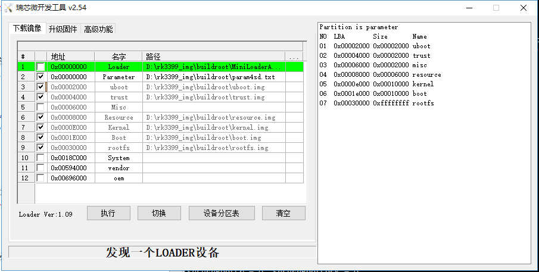
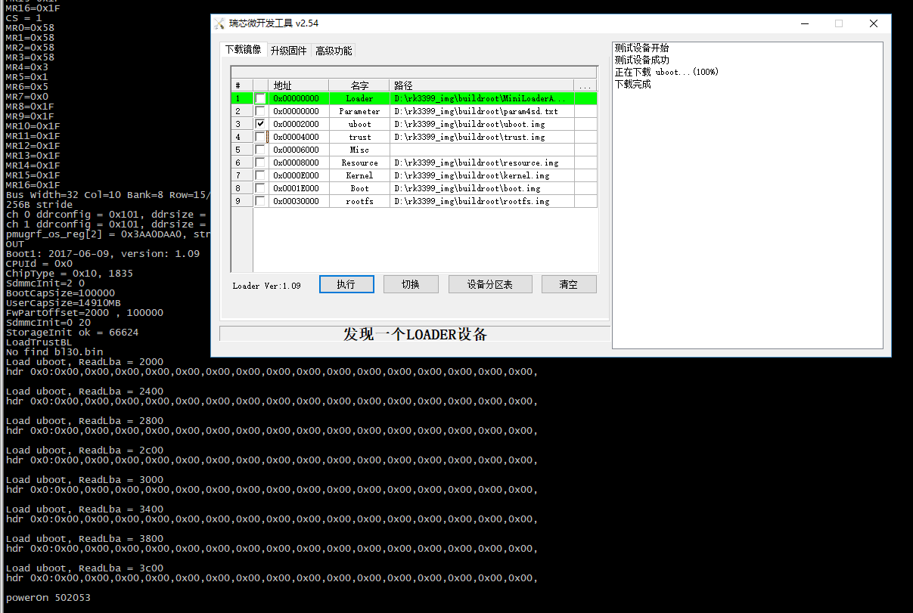
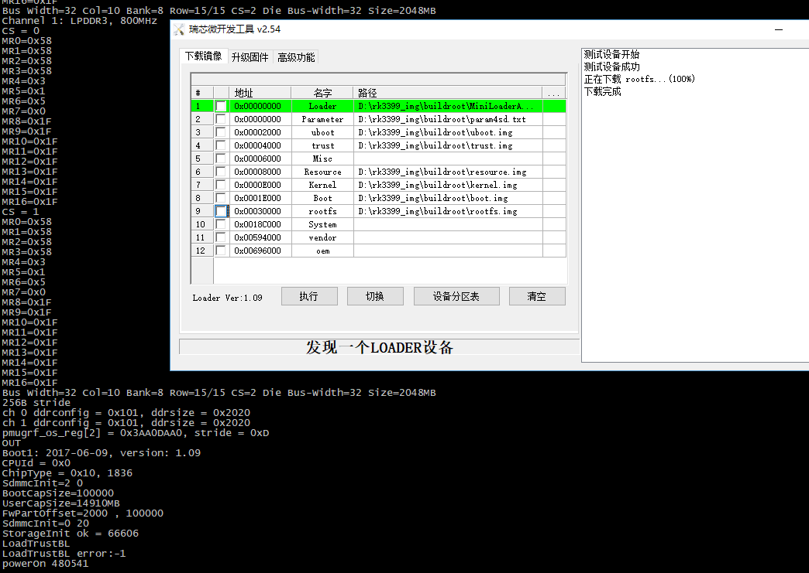
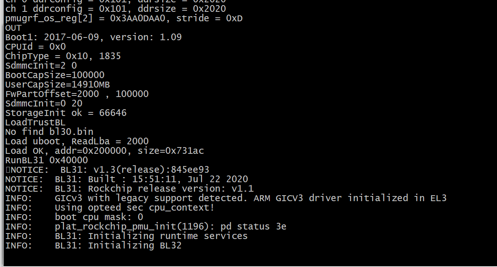

## RK3399 GPT分区

参考资料

https://blog.csdn.net/fhy00229390/article/details/112980643

## 烧录操作界面



ps：烧录前需要正确写入分区表到0地址，对应的镜像起始地址要配置对，如图上右边所示

> D:\rk3399_img\buildroot\param4sd.txt  文件root字段要修改成正确的rootfs分区

```
修改前：
CMDLINE: root=/dev/mmcblk0p1

修改后：
CMDLINE: root=/dev/mmcblk1p7
```

linux启动日志：

```shell
[    1.030302] mmcblk1: mmc1:0001 AJTD4R 14.6 GiB 
[    1.031318] mmcblk1boot0: mmc1:0001 AJTD4R partition 1 4.00 MiB
[    1.032335] mmcblk1boot1: mmc1:0001 AJTD4R partition 2 4.00 MiB
[    1.033307] mmcblk1rpmb: mmc1:0001 AJTD4R partition 3 4.00 MiB
[    1.034409]      uboot: 0x000400000 -- 0x000800000 (4 MB)
[    1.034907]      trust: 0x000800000 -- 0x000c00000 (4 MB)
[    1.035386]       misc: 0x000c00000 -- 0x001000000 (4 MB)
[    1.035878]   resource: 0x001000000 -- 0x001c00000 (12 MB)
[    1.036368]     kernel: 0x001c00000 -- 0x003c00000 (32 MB)
[    1.036869]       boot: 0x003c00000 -- 0x005c00000 (32 MB)
[    1.037359]     rootfs: 0x006000000 -- 0x3a3a00000 (14810 MB)
[    1.037917]  mmcblk1: p1 p2 p3 p4 p5 p6 p7
```

启动后正常进入系统后log：

```shell
[root@rk3399:/]# cat /proc/cmdline 
earlycon=uart8250,mmio32,0xff1a0000 swiotlb=1 console=ttyFIQ0 rw root=PARTUUID=614e0000-0000 rootfstype=ext4 rootwait root=/dev/mmcblk1p7 rw rootfstype=ext4 mtdparts=rk29xxnand:0x00002000@0x00002000(uboot),0x00002000@0x00004000(trust),0x00002000@0x00006000(misc),0x00006000@0x00008000(resource),0x00010000@0x0000e000(kernel),0x00010000@0x0001e000(boot),-@0x00030000(rootfs) storagemedia=emmc uboot_logo=0x02000000@0xf5c00000 loader.timestamp=2022-02-27_15:11:27 SecureBootCheckOk=0 androidboot.mode=emmc
[root@rk3399:/]# cat /proc/version 
Linux version 4.4.154 (user@host) (gcc version 6.3.1 20170404 (Linaro GCC 6.3-2017.05) ) #3 SMP Sun Feb 27 15:13:04 CST 2022
[root@rk3399:/]# 
```

## 擦除操作说明：

升级固件下的【擦除Flash】会将整个emmc器件全部擦除

#### linux下使用dd命令删除分区进行测试

>[root@rk3399:/]# cat /proc/partitions 
>major minor  #blocks  name
>
>   1        0       4096 ram0
>   1        1       4096 ram1
>   1        2       4096 ram2
>   1        3       4096 ram3
>   1        4       4096 ram4
>   1        5       4096 ram5
>   1        6       4096 ram6
>   1        7       4096 ram7
> 259        0  250059096 nvme0n1
> 259        1  250051693 nvme0n1p1
> 179        0   15267840 mmcblk1
> 179        1       4096 mmcblk1p1
> 179        2       4096 mmcblk1p2
> 179        3       4096 mmcblk1p3
> 179        4      12288 mmcblk1p4
> 179        5      32768 mmcblk1p5
> 179        6      32768 mmcblk1p6
> 179        7   15165440 mmcblk1p7
> 179       96       4096 mmcblk1rpmb
> 179       64       4096 mmcblk1boot1
> 179       32       4096 mmcblk1boot0

##### dd if=/dev/zero of=/dev/mmcblk1p1

```
Bus Width=32 Col=10 Bank=8 Row=15/15 CS=2 Die Bus-Width=32 Size=2048MB
256B stride
ch 0 ddrconfig = 0x101, ddrsize = 0x2020
ch 1 ddrconfig = 0x101, ddrsize = 0x2020
pmugrf_os_reg[2] = 0x3AA0DAA0, stride = 0xD
OUT
Boot1: 2017-06-09, version: 1.09
CPUId = 0x0
ChipType = 0x10, 1838
SdmmcInit=2 0
BootCapSize=100000
UserCapSize=14910MB
FwPartOffset=2000 , 100000
SdmmcInit=0 20
StorageInit ok = 66604
LoadTrustBL
No find bl30.bin
Load uboot, ReadLba = 2000
hdr 0x0:0x00,0x00,0x00,0x00,0x00,0x00,0x00,0x00,0x00,0x00,0x00,0x00,0x00,0x00,0x00,0x00,

Load uboot, ReadLba = 2400
hdr 0x0:0x00,0x00,0x00,0x00,0x00,0x00,0x00,0x00,0x00,0x00,0x00,0x00,0x00,0x00,0x00,0x00,

Load uboot, ReadLba = 2800
hdr 0x0:0x00,0x00,0x00,0x00,0x00,0x00,0x00,0x00,0x00,0x00,0x00,0x00,0x00,0x00,0x00,0x00,

Load uboot, ReadLba = 2c00
hdr 0x0:0x00,0x00,0x00,0x00,0x00,0x00,0x00,0x00,0x00,0x00,0x00,0x00,0x00,0x00,0x00,0x00,

Load uboot, ReadLba = 3000
hdr 0x0:0x00,0x00,0x00,0x00,0x00,0x00,0x00,0x00,0x00,0x00,0x00,0x00,0x00,0x00,0x00,0x00,

Load uboot, ReadLba = 3400
hdr 0x0:0x00,0x00,0x00,0x00,0x00,0x00,0x00,0x00,0x00,0x00,0x00,0x00,0x00,0x00,0x00,0x00,

Load uboot, ReadLba = 3800
hdr 0x0:0x00,0x00,0x00,0x00,0x00,0x00,0x00,0x00,0x00,0x00,0x00,0x00,0x00,0x00,0x00,0x00,

Load uboot, ReadLba = 3c00
hdr 0x0:0x00,0x00,0x00,0x00,0x00,0x00,0x00,0x00,0x00,0x00,0x00,0x00,0x00,0x00,0x00,0x00,

powerOn 502055
```

> **擦除后，仍可进入到Loader状态**



##### dd if=/dev/zero of=/dev/mmcblk1p2

启动后报错如下:

```shell
Bus Width=32 Col=10 Bank=8 Row=15/15 CS=2 Die Bus-Width=32 Size=2048MB
256B stride
ch 0 ddrconfig = 0x101, ddrsize = 0x2020
ch 1 ddrconfig = 0x101, ddrsize = 0x2020
pmugrf_os_reg[2] = 0x3AA0DAA0, stride = 0xD
OUT
Boot1: 2017-06-09, version: 1.09
CPUId = 0x0
ChipType = 0x10, 1834
SdmmcInit=2 0
BootCapSize=100000
UserCapSize=14910MB
FwPartOffset=2000 , 100000
SdmmcInit=0 20
StorageInit ok = 66629
LoadTrustBL
LoadTrustBL error:-1                   //说明擦除的是trust.img文件，通过工具重烧录trust.img后启动正常（自测过），说明分区表p1为uboot分区
powerOn 480563
```

显示界面截图：

说明：loader还在，能正常进入下载



##### 将1236分区全部擦除测试，仍可进入到Loader状态

```
[root@rk3399:/]# dd if=/dev/zero of=/dev/mmcblk1p1
dd: writing '/dev/mmcblk1p1': No space left on device
8193+0 records in
8192+0 records out
[root@rk3399:/]# dd if=/dev/zero of=/dev/mmcblk1p2
dd: writing '/dev/mmcblk1p2': No space left on device
8193+0 records in
8192+0 records out
[root@rk3399:/]# dd if=/dev/zero of=/dev/mmcblk1p3
dd: writing '/dev/mmcblk1p3': No space left on device
8193+0 records in
8192+0 records out[root@rk3399:/]# dd if=/dev/zero of=/dev/mmcblk1p6
dd: writing '/dev/mmcblk1p6': No space left on device
65537+0 records in
65536+0 records out
[root@rk3399:/]# 
```

> 仍可进入到Loader状态，说明loader镜像不在emmc的数据区，那是mmcblk1boot0或是mmcblk1boot1？

无法直接擦除boot分区

```shell
[root@rk3399:/]# dd if=/dev/zero of=/dev/mmcblk1boot1
dd: writing '/dev/mmcblk1boot1': Operation not permitted
1+0 records in
0+0 records out
[root@rk3399:/]# dd if=/dev/zero of=/dev/mmcblk1boot0
dd: writing '/dev/mmcblk1boot0': Operation not permitted
1+0 records in
0+0 records out
[root@rk3399:/]# 
```

但是重新烧录不正确的trust.img后，再重启，却无法正常进入到loader下


