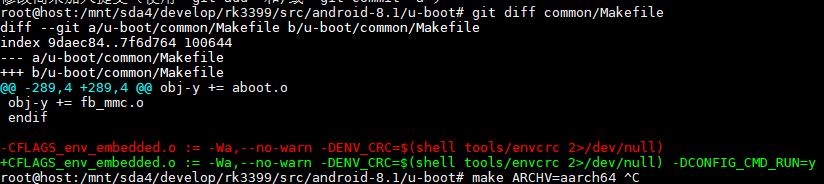
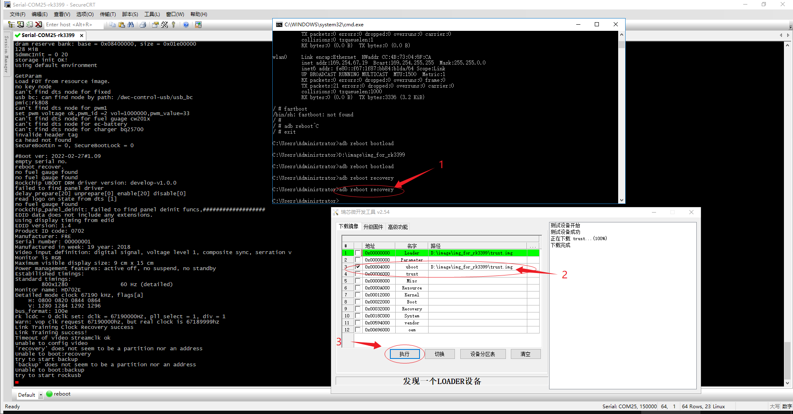

# rk3399 u-boot wiki

http://opensource.rock-chips.com/wiki_Boot_option

# rk3399 u-boot编译

# github.com下载的u-boot编译

## 代码下载

```
cd /mnt/sda4/develop/rk3399/src/android-8.1/
git clone git@github.com:rockchip-linux/u-boot.git u-boot.clone
```

## 编译过程

```
./make.sh help
./make.sh uboot
./make.sh evb-rk3399
```

## 依赖安装

```
sudo apt-get install gawk
```


# android sdk下u-boot编译

## 方式一：sdk目录下编译

```shell
cd /mnt/sda4/develop/rk3399/src/android-8.1

./build-nanopc-t4.sh -B
```


## 方式2：进入u-boot目录下编译

```shell
cd /mnt/sda4/develop/rk3399/src/android-8.1
cd u-boot
make rk3399_defconfig
make ARCHV=aarch64
```

## 修改配置项

修改配置项：**make menuconfig**无法显示所有的配置项，单独在 **Makefile**中增加**-D**选项

增加run 命令与bootargs命令，烧录后并未生效



# 从零下载编译烧录 u-boot

## github.com下载

```shell
cd /mnt/sda4/develop/rk3399/src/rockchip-linux
sudo git clone https://github.com/rockchip-linux/rkbin.git
sudo git clone https://github.com/rockchip-linux/rkdeveloptool.git  //如果选择使用prebuilts目录的toolchain，可不下载
sudo git clone https://github.com/rockchip-linux/u-boot.git
```

### 编译工具链接安装

> Ubuntu 16.04.6 LTS下自行编译失败

```shell
sudo apt install autoconf          //安装依赖工具
sudo apt install -y libusb-dev     
export PKG_CONFIG_PATH=/lib/x86_64-linux-gnu/
export PKG_CONFIG_LIBDIR=/lib/x86_64-linux-gnu/
echo $PKG_CONFIG_PATH
#PKG_CONFIG_LIBDIR的优先级比 PKG_CONFIG_PATH 高，所以会覆盖PKG_CONFIG_PATH的设置

cd rkdevloptool
autoreconf -i
./configure	
make
sudo make install
```

### 使用android现有的

```
cd /mnt/sda4/develop/rk3399/src/rockchip-linux
ln -s ../android-8.1/prebuilts prebuilts
```

### 编译u-boot

```
cd /mnt/sda4/develop/rk3399/src/rockchip-linux/u-boot
sudo make.sh
```

### 编译atf

```shell
cd /mnt/sda4/develop/rk3399/src/rockchip-linux/

chmod 600 ~/.ssh/id_ed25519
#地址一：
git clone https://github.com/ARM-software/arm-trusted-firmware.git
#地址二：
git clone git@gitee.com:yk_rk3399/arm-trusted-firmware.git

export PATH=/mnt/sda4/develop/rk3399/src/rockchip-linux/prebuilts/gcc/linux-x86/aarch64/gcc-linaro-6.3.1-2017.05-x86_64_aarch64-linux-gnu/bin/:$PATH
sudo apt install gcc-arm-none-eabi     //安装依赖toolchain

cd /mnt/sda4/develop/rk3399/src/rockchip-linux/arm-trusted-firmware
sudo make CROSS_COMPILE=aarch64-linux-gnu- PLAT=rk3399

输出文件：
/mnt/sda4/develop/rk3399/src/rockchip-linux/arm-trusted-firmware/build/rk3399/release/bl31/bl31.elf

```


# U-Boot.img说明

参考：

[Rockchip | 启动引导的各个阶段及其对应固件](https://blog.csdn.net/Neutionwei/article/details/110501710)

从RK3399启动流程图中我们能看到，U-Boot包里面除了u-boot.dtb和u-boot-nodtb.bin这两个U-Boot源码编译出来的文件之外，还包含了bl31.elf、bl32.bin、tee.bin等ARM trust固件。其中bl31.elf是必须要有的，bl32.bin、tee.bin是可选的，可以没有。

## RK3399TRUST.ini

用于配置生成trust.img的源文件

vim ../rkbin/RKTRUST/RK3399TRUST.ini

```
[VERSION]
MAJOR=1
MINOR=0
[BL30_OPTION]
SEC=0
[BL31_OPTION]
SEC=1
PATH=bin/rk33/rk3399_bl31_v1.35.elf
ADDR=0x00040000
[BL32_OPTION]
SEC=1
PATH=bin/rk33/rk3399_bl32_v2.01.bin
ADDR=0x08400000
[BL33_OPTION]
SEC=0
[OUTPUT]
PATH=trust.img
```


## RK3399MINIALL.ini

vim ../rkbin/RKBOOT/RK3399MINIALL.ini

```
[CHIP_NAME]
NAME=RK330C
[VERSION]
MAJOR=1
MINOR=26
[CODE471_OPTION]
NUM=1
Path1=bin/rk33/rk3399_ddr_800MHz_v1.25.bin
Sleep=1
[CODE472_OPTION]
NUM=1
Path1=bin/rk33/rk3399_usbplug_v1.26.bin
[LOADER_OPTION]
NUM=2
LOADER1=FlashData
LOADER2=FlashBoot
FlashData=bin/rk33/rk3399_ddr_800MHz_v1.25.bin
FlashBoot=bin/rk33/rk3399_miniloader_v1.26.bin
[OUTPUT]
PATH=rk3399_loader_v1.25.126.bin
```


## TPL 

U-Boot TPL 用于 ddr 初始化

## SPL

SPL用于 trust（ATF/OP-TEE）加载并运行到下一阶段

## bl31.elf

## bl32.bin

### 参考教程：

[TEE OS 开发基于OP-Tee，MTK平台的移植方法](https://blog.csdn.net/junwua/article/details/80505826?spm=1001.2101.3001.6650.1&utm_medium=distribute.pc_relevant.none-task-blog-2~default~BlogCommendFromBaidu~default-1-80505826-blog-79129268.pc_relevant_vip_default&depth_1-utm_source=distribute.pc_relevant.none-task-blog-2~default~BlogCommendFromBaidu~default-1-80505826-blog-79129268.pc_relevant_vip_default&utm_relevant_index=2)

https://github.com/rockchip-linux/u-boot/issues/63

https://dev.t-firefly.com/thread-13914-1-6.html

### 代码下载：

```shell
cd /mnt/sda4/develop/rk3399/src/rockchip-linux/open-tee
repo init -u https://github.com/OP-TEE/manifest.git -m default.xml --repo-url=git://codeaurora.org/tools/repo.git
repo init -u git@gitee.com:yk_rk3399/op-tee_manifest.git -m default.xml --repo-url=git://codeaurora.org/tools/repo.git
repo sync
```


```
repo init -u git@gitee.com:op-tee/manifest.git -m yk_rk3399.xml --repo-url=git://codeaurora.org/tools/repo.git
repo sync

```


### 编译步骤：


## tee.bin

## idbloader.img


# rk3399 u-boot烧录操作

1.  选择烧录文件

2. 单板启动到linux下，烧录工作显示【发现一个adb设备】

   

3. cmd下通过adb reboot recovery使单板启动到等待recovery状态，此时烧录工具会显示为【发现一个LOADER设备】

   

###  整体截图如下：

