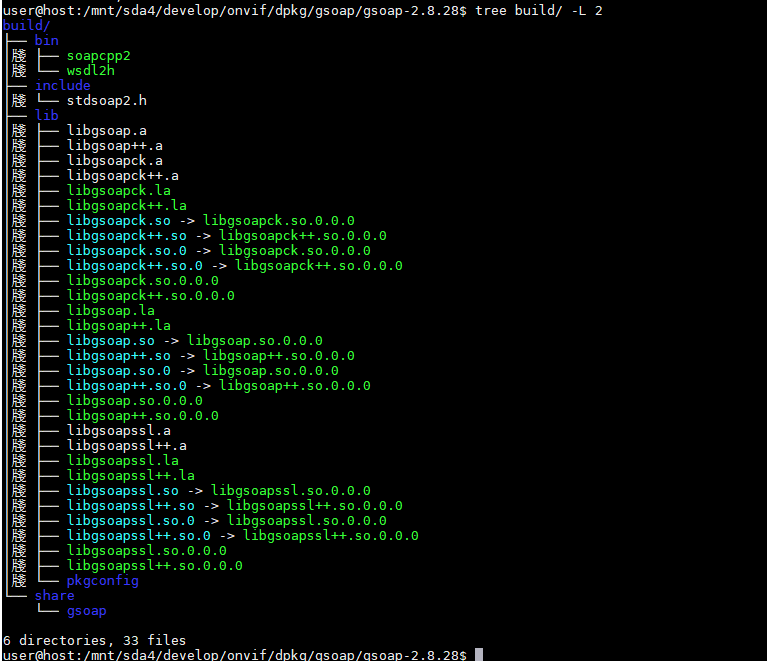

## gsoap源码编译

#### gsoap-2.8.28版本编译

```shell
#gsoap
cd /mnt/sda4/develop/onvif/dpkg/gsoap/gsoap-2.8.28/
rm -rf ./*;apt source gsoap
./configure --prefix=/mnt/sda4/develop/onvif/dpkg/gsoap/gsoap-2.8.28/build/
aclocal
make
make install
tree build/ -L 2
```




### gsoap-2.8.104版本编译

使用raspberry下载源码

```
cd /home/pi/dpkg/gsoap
rm -rf ./*;apt source gsoap
```

ubuntu系统拷贝raspberry下载的源码

```
cd /mnt/sda4/develop/onvif/dpkg/gsoap/gsoap-2.8.104/
scp -r  pi@192.168.1.100:/home/pi/dpkg/gsoap/gsoap-2.8.104 ./
automake --add-missing   //用于解决：[automake-1.16: 未找到命令]
libtoolize --automake --copy --debug --force 
./configure --prefix=/mnt/sda4/develop/onvif/dpkg/gsoap/gsoap-2.8.104/build/
make
make install
tree build/ -L 2

```

