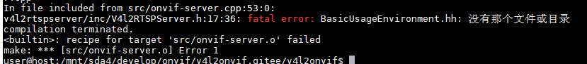
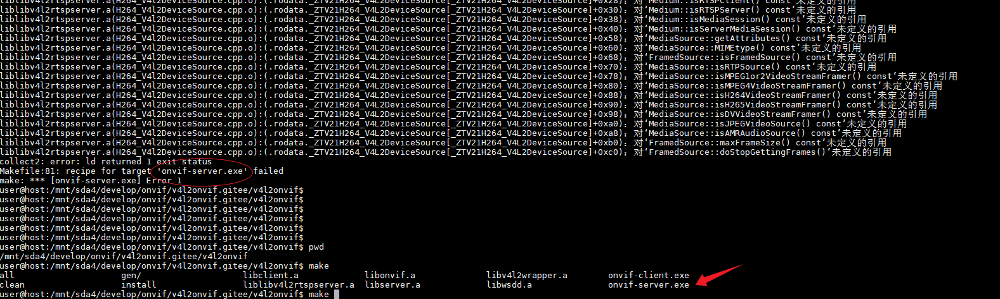

## fatal error: BasicUsageEnvironment.hh: 没有那个文件或目录



解决办法：

```
sudo apt install -y liblivemedia-dev
cp /usr/include/BasicUsageEnvironment/BasicUsageEnvironment.hh v4l2rtspserver/inc/
cp /usr/include/BasicUsageEnvironment/*.hh v4l2rtspserver/inc/
cp /usr/include/UsageEnvironment/*.hh v4l2rtspserver/inc/
cp /usr/include/liveMedia/*.hh v4l2rtspserver/inc/ -f


apt install -y liblog4cpp5-dev libasound2-dev
cp /usr/include/groupsock/NetCommon.h v4l2rtspserver/inc/ -f
cp /usr/include/groupsock/GroupsockHelper.hh v4l2rtspserver/inc/ -f
cp /usr/include/groupsock/*.hh v4l2rtspserver/inc/ -f
```


​	

## liblibv4l2rtspserver.a(H264_V4l2DeviceSource.cpp.o):(.rodata._ZTV21H264_V4L2DeviceSource[_ZTV21H264_V4L2DeviceSource]+0xc0)：对‘FramedSource::doStopGettingFrames()’未定义的引用



从报错可看出为make时出错

make onvif-server

解决办法：

加载对应的libxxx.a库

