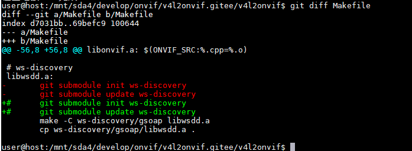

```
cd /mnt/sda4/develop/onvif/v4l2onvif.gitee/v4l2onvif

# 解决下面报错
# wsdl2h: Unknown option L
sudo cp /usr/bin/wsdl2h //usr/bin/wsdl2h.bak
sudo cp /mnt/sda4/develop/onvif/dpkg/gsoap/gsoap-2.8.104/build/bin/wsdl2h /usr/bin/wsdl2h

vim Makefile             #修改内容： 1 )、修改Makefile，手动从gitee下载git仓库

git clone git@gitee.com:yk_rk3399/ws-discovery.git
git clone git@gitee.com:yk_rk3399/v4l2rtspserver.git
git clone https://gitee.com/xunxinyuan/hls.js v4l2rtspserver/hls
git clone git@gitee.com:yk_rk3399/v4l2wrapper.git v4l2rtspserver/v4l2wrapper

make


```

1 )、修改Makefile，手动从gitee下载git仓库


