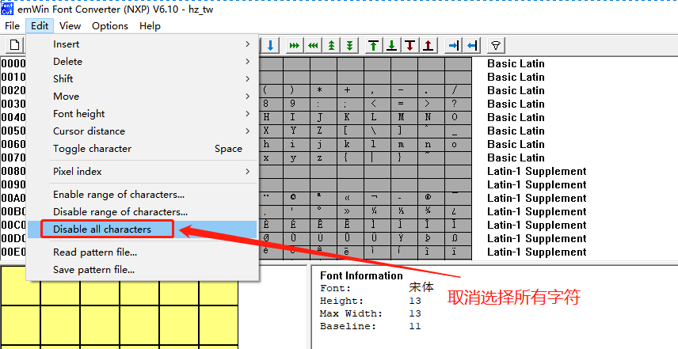
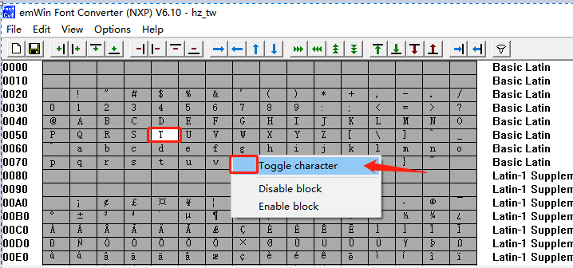
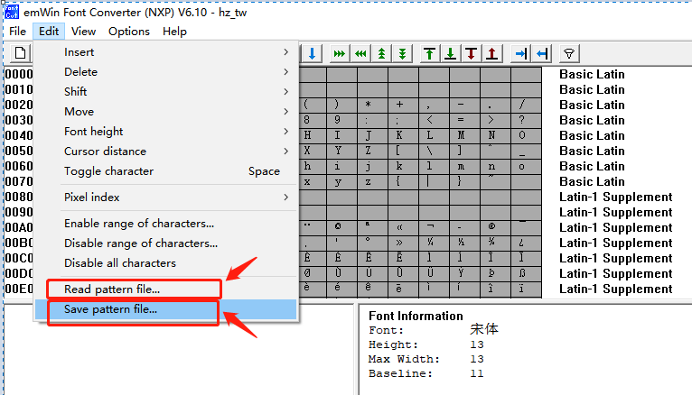

[TOC]

## 汉字显示

### 方式一：使用FontCvtNXP.exe工具一次性读取

> 目前这种方式在win10简体中文版本支持的不好，因为无法将文本保存为unicode，现有都是utf-8

> 推荐步骤：通过FontCvtNXP.exe工具先保存，再编辑刚保存的txt文件，清空文件，将需要显示的字符输入到txt文件，再导出.c

**step 1)、打开FontCvtNXP取消选择所有字符**

**step 2)、随便选择两个字符进行保存（以TW为例）**

**step 3)、保存unicode字符，然后编辑再读取**

先save，再编辑，再Read

**step 4)、另存为 xxx.c文件 **

### 方式二：一个个汉字取unicode，再通过FontCvtNXP.exe选中相应汉字即可

