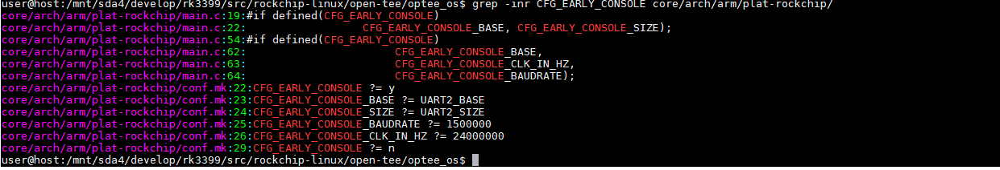

## 配置文件

#### core\arch\arm\plat-rockchip\platform_config.h

```c
/* SPDX-License-Identifier: BSD-2-Clause */
/*
 * Copyright (C) 2017, Fuzhou Rockchip Electronics Co., Ltd.
 * Copyright (C) 2019, Theobroma Systems Design und Consulting GmbH
 */

#ifndef PLATFORM_CONFIG_H
#define PLATFORM_CONFIG_H

#include <mm/generic_ram_layout.h>

/* Make stacks aligned to data cache line length */
#define STACK_ALIGNMENT		64

#define SIZE_K(n)		((n) * 1024)
#define SIZE_M(n)		((n) * 1024 * 1024)

#if defined(PLATFORM_FLAVOR_rk322x)

#define GIC_BASE		0x32010000
#define GIC_SIZE		SIZE_K(64)
#define GICD_BASE		(GIC_BASE + 0x1000)
#define GICC_BASE		(GIC_BASE + 0x2000)

#define SGRF_BASE		0x10140000
#define SGRF_SIZE		SIZE_K(64)

#define DDRSGRF_BASE		0x10150000
#define DDRSGRF_SIZE		SIZE_K(64)

#define GRF_BASE		0x11000000
#define GRF_SIZE		SIZE_K(64)

#define UART2_BASE		0x11030000
#define UART2_SIZE		SIZE_K(64)

#define CRU_BASE		0x110e0000
#define CRU_SIZE		SIZE_K(64)

/* Internal SRAM */
#define ISRAM_BASE		0x10080000
#define ISRAM_SIZE		SIZE_K(8)

#elif defined(PLATFORM_FLAVOR_rk3399)

#define MMIO_BASE		0xF8000000

#define GIC_BASE		(MMIO_BASE + 0x06E00000)
#define GIC_SIZE		SIZE_M(2)
#define GICD_BASE		GIC_BASE
#define GICR_BASE		(GIC_BASE + SIZE_M(1))

#define UART0_BASE		(MMIO_BASE + 0x07180000)
#define UART0_SIZE		SIZE_K(64)

#define UART1_BASE		(MMIO_BASE + 0x07190000)
#define UART1_SIZE		SIZE_K(64)

#define UART2_BASE		(MMIO_BASE + 0x071A0000)
#define UART2_SIZE		SIZE_K(64)

#define UART3_BASE		(MMIO_BASE + 0x071B0000)
#define UART3_SIZE		SIZE_K(64)

#define SGRF_BASE		(MMIO_BASE + 0x07330000)
#define SGRF_SIZE		SIZE_K(64)

#elif defined(PLATFORM_FLAVOR_px30)

#define GIC_BASE		0xff130000
#define GIC_SIZE		SIZE_K(64)
#define GICD_BASE		(GIC_BASE + 0x1000)
#define GICC_BASE		(GIC_BASE + 0x2000)

#define UART1_BASE		0xff158000
#define UART1_SIZE		SIZE_K(64)

#define UART2_BASE		0xff160000
#define UART2_SIZE		SIZE_K(64)

#define UART5_BASE		0xff178000
#define UART5_SIZE		SIZE_K(64)

#define FIREWALL_DDR_BASE	0xff534000
#define FIREWALL_DDR_SIZE	SIZE_K(16)

#else
#error "Unknown platform flavor"
#endif

#ifdef CFG_WITH_LPAE
#define MAX_XLAT_TABLES		5
#endif

#endif

```


#### core\arch\arm\plat-rockchip\conf.mk

```makefile
PLATFORM_FLAVOR ?= rk3399
CONFIG_LOG=y
$(call force,CFG_GIC,y)
$(call force,CFG_SECURE_TIME_SOURCE_CNTPCT,y)
$(call force,CFG_8250_UART,y)

CFG_DT ?= y
CFG_WITH_STATS ?= y
CFG_NUM_THREADS ?= 4

ifeq ($(PLATFORM_FLAVOR),rk322x)
include ./core/arch/arm/cpu/cortex-a7.mk
$(call force,CFG_TEE_CORE_NB_CORE,4)
$(call force,CFG_PSCI_ARM32,y)
$(call force,CFG_BOOT_SECONDARY_REQUEST,y)

CFG_TZDRAM_START ?= 0x68400000
CFG_TZDRAM_SIZE ?= 0x00200000
CFG_SHMEM_START ?= 0x68600000
CFG_SHMEM_SIZE ?= 0x00100000

CFG_EARLY_CONSOLE ?= y
CFG_EARLY_CONSOLE_BASE ?= UART2_BASE
CFG_EARLY_CONSOLE_SIZE ?= UART2_SIZE
CFG_EARLY_CONSOLE_BAUDRATE ?= 1500000
CFG_EARLY_CONSOLE_CLK_IN_HZ ?= 24000000
endif

CFG_EARLY_CONSOLE ?= n

ifeq ($(PLATFORM_FLAVOR),rk3399)
include core/arch/arm/cpu/cortex-armv8-0.mk
$(call force,CFG_TEE_CORE_NB_CORE,6)
$(call force,CFG_ARM_GICV3,y)

CFG_TZDRAM_START ?= 0x30000000
CFG_TZDRAM_SIZE  ?= 0x02000000
CFG_SHMEM_START  ?= 0x32000000
CFG_SHMEM_SIZE   ?= 0x00400000
endif

ifeq ($(PLATFORM_FLAVOR),px30)
include core/arch/arm/cpu/cortex-armv8-0.mk
$(call force,CFG_TEE_CORE_NB_CORE,4)

CFG_TZDRAM_START ?= 0x30000000
CFG_TZDRAM_SIZE  ?= 0x02000000
CFG_SHMEM_START  ?= 0x32000000
CFG_SHMEM_SIZE   ?= 0x00400000
endif

ifeq ($(platform-flavor-armv8),1)
$(call force,CFG_ARM64_core,y)
$(call force,CFG_WITH_ARM_TRUSTED_FW,y)
$(call force,CFG_WITH_LPAE,y)
ta-targets = ta_arm64
endif

```

## 配置项

### CFG_EARLY_CONSOLE


