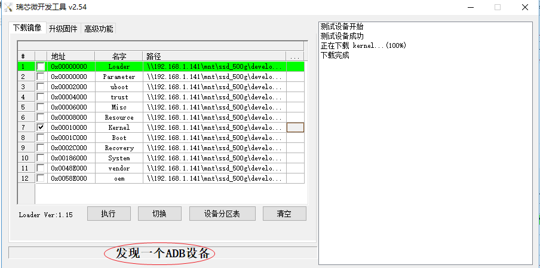
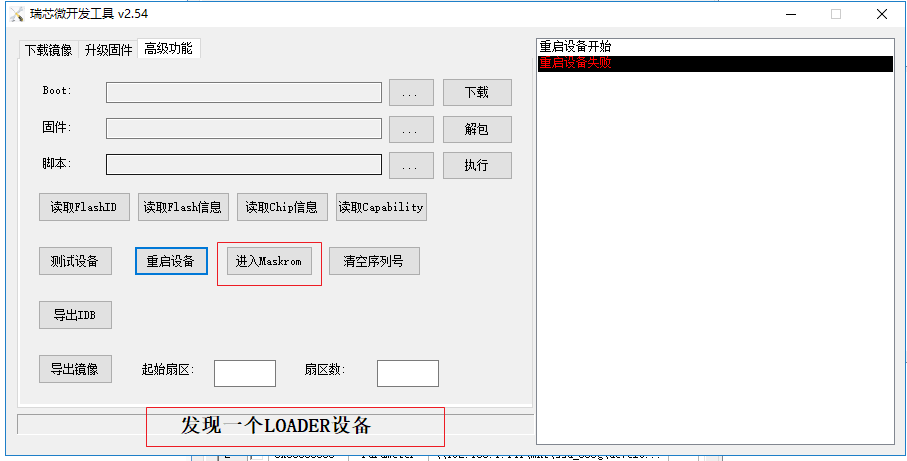
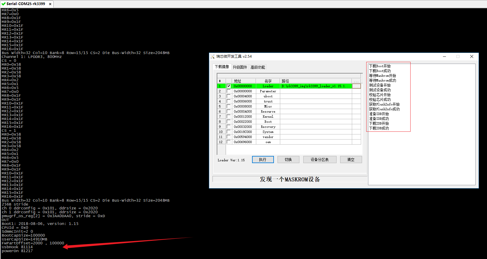
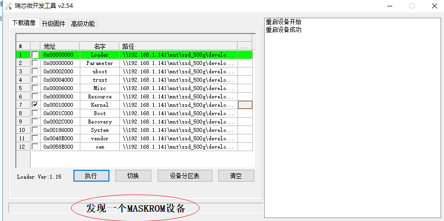
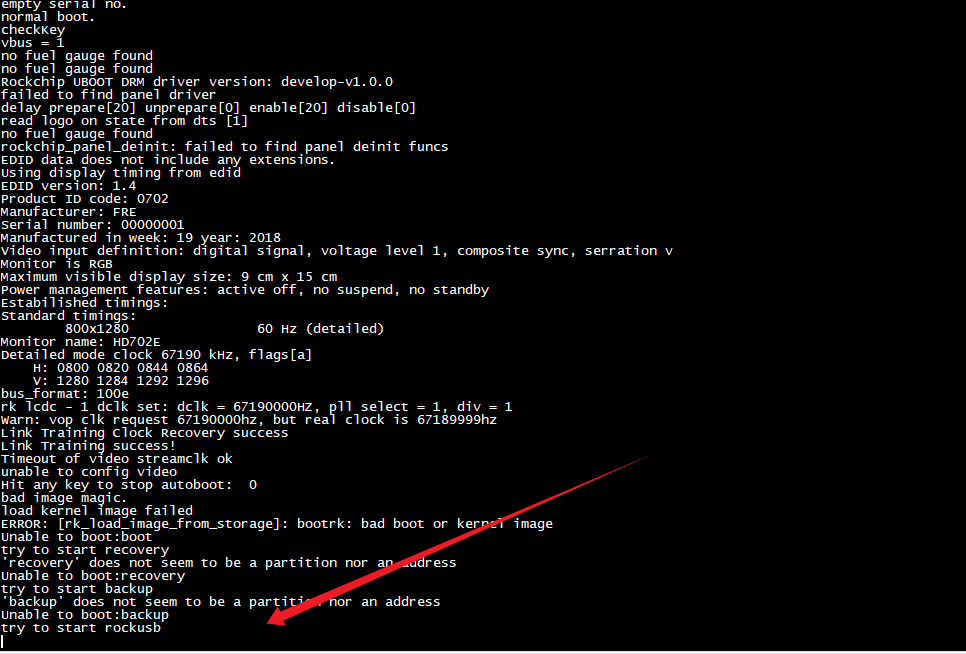
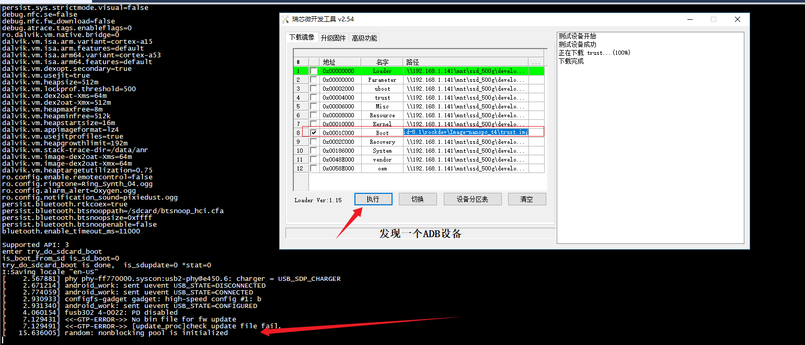

# 烧录操作（loader状态才可烧录）

## 使用type-c烧录操作

### 单板连接时运行状态

#### adb设备状态



#### loader模式

##### 进入方法：前提是已经烧录了loader程序

1. 开机按Recovery键



##### 下载loader:

ps:下载成功后需要重新按reset键



#### maskboot模式

##### 进入方法：

1. 在loader模式时，可通过【瑞芯微开发工具】=》【高级功能】=》【进入Maskrom】
2. ==开机时按住【Boot键】==




 RK3399有三种启动模式：1、Normal模式；2、Loader模式；3、MaskRom模式。

- Normal模式是正常的启动过程，各个组件依次加载，直到正常进入系统。

- Loader模式会让bootloader进入升级状态，等待主机命令，用于固件升级等。Firefly-RK3399要进入Loader模式，需要在bootloader启动时检测到RECOVERY（恢复）键被按下，并且USB处于和PC连接的状态。

- MaskRom模式是设备变砖的最后一条防线，用于bootloader损坏时进行系统修复。一般情况下是不用进入MaskRom模式的，只有在设备进入不了Loader模式（bootloader校验失败，读取不了IDR块，或bootloader损坏）、SD卡启动也失效的情况下，BootRom代码才会进入MaskRom模式。<u>此时BootRom代码等待主机通过USB接口传送bootloader代码，传送完成后进行加载并运行，并进入Loader模式。</u> 

  MaskRom 模式用于 bootloader 损坏时的系统修复。
  一般情况下是不用进入 MaskRom 模式的，只有在 bootloader 校验失败（读取不了 IDR 块，或 bootloader 损坏） 的情况下，BootRom 代码 就会进入 MaskRom 模式。此时 BootRom 代码等待主机通过 USB 接口传送 bootloader 代码，加载并运行之。

  如果开发板上电后遇到以下情况之一：

  eMMC 内容为空。
  eMMC 上的 bootloader 损坏。
  将 eMMC 数据/时钟引脚接地，eMMC读取数据失败。(所以硬件设计要预留eMMC clock PIN用于进入MaskROM模式 )
  CPU 在 eMMC 中就会找不到有效的 IDB (IDentity Block)，转而执行一段小型的 ROM 代码，等待主机通过 USB 上传 bootloader 来初始化 DDR 内存并进入升级状态。这种模式称为 Maskrom 模式 。
  
  [关于loader和maskrom模式的补充说明：](https://wiki.friendlyelec.com/wiki/index.php/NanoPC-T4/zh)
  
  - 如果eMMC没有烧写过系统或eMMC的系统被擦除或损坏则会显示为MASKROM设备;
  - 您也可以按住BOOT键再长按Power键开机（保持按下BOOT键5秒以上），将强制进入MASKROM模式;
  - 如果显示“没有发现设备”，请先检查是否已成功安装驱动，检查Type-C数据线然后按上述方法重新开机，或按住Recovery键再按Reset键;
  - 可通过串口、adb或ssh等方式在终端上执行reboot loader命令让开发板重启，重启后自动进入LOADER模式;

#### 没有发现设备

设备正在启动时，不会显示上面的loader、maskboot状态

### 烧录原理

单板通过usb连接发送adb命令给os（android,linux-qt），让其运行到loader状态，然后通过【瑞芯微开发工具 vx.xx】软件去发送相应的烧录命令给loader状态的uboot去解释、烧写相应的数据文件

```
adb reboot fastboot   //uboot进入此状态后,软件也会显示为adb设备

adb reboot loader    

adb reboot recovery
```


### 读取设备分区表

**<u>仅loader状态可读取</u>**

adb状态不可读取

fastboot状态不可读取


## qt环境擦除分区


操作步骤：

1.  adb reboot loader
2. 当显示上面发现一个LOADER设备后，点击执行即可

操作结果：可正常擦除kernel，擦除后启动停止在下图所示



### qt环境分区表

//QT下分区表信息:
[root@rk3399:/]# cat /proc/cmdline 
earlycon=uart8250,mmio32,0xff1a0000 swiotlb=1 consolse=ttyFIQ0 rootwait coherent_pool=1m root=/dev/mmcblk1p7 rw rootfstype=ext4 consoleblank=0 mtdparts=rk29xxnand:0x00002000@0x00002000(uboot),0x00002000@0x00004000(trust),0x00002000@0x00006000(misc),0x00006000@0x00008000(resource),0x00010000@0x0000e000(kernel),0x00010000@0x0001e000(boot),-@0x00030000(rootfs) lcd=HD702E,213dpi storagemedia=emmc uboot_logo=0x02000000@0xf5c00000 loader.timestamp=2019-09-03_15:52:05 SecureBootCheckOk=0 androidboot.mode=emmc


## android环境擦除分区


### boot分区替换成trust.img

此时串口将会停止启动，屏幕将会显示在Android Recovery状态




## 无法擦除情况验证

### 使用eflasher下载镜像：

通过sd卡启动烧录sd卡（16G）中百度网盘下载的eflash镜像，无法正常更新单个镜像文件，通过root用户在root系统下创建修改的文件，重启后会被还原

1. 烧录时是否选择disable overlay filesystem重启后都不会被保存
2. mount -o rw,remount /               #重新加载rootfs为可rw，重启后，修改会被还原
3. 使用开发工具也无法单独擦除kernel分区(将此分区镜像用其它的trust.img替换)

### 使用开发工具下载镜像:

环境说明：

​    编译的为userdebug版本，android系统未开启开发模式

1. mount -o rw,remount /               #重新加载rootfs为可rw，重启后，修改会被还原，**是否为开发者模式均无效**
2. 使用开发工具也可单独擦除kernel分区(将此分区镜像用其它的trust.img替换)
3. 

### 二者差异：

使用开发工具下载镜像，则可单独重烧镜像文件

# adb命令

adb reboot bootloader
adb reboot recovery

//anroid下重新挂载rootfs
mount -o rw,remount /

adb reboot bootloader
adb reboot recovery

进入开发者模式：
	设置》系统》关于平板电脑》版本号（点击三下）
	
	
//重新挂载system分区

adb root
adb disable-verity
adb reboot

adb root
adb remount


adb  reboot  fastboot
fastboot  flashing  unlock    # 设备解锁，开始刷机
fastboot oem unlock

//fastboot烧录操作记录
QT环境启动到fastboot，擦除kernel分区
>adb  reboot  fastboot
>fastboot erase kernel
>fastboot reboot
>上面命令执行成功，但并未擦除分区，仍可正常启动

//load下烧录
adb reboot loader

# 开发者模式

​	设置》系统》关于平板电脑》版本号（点击三下）


# Android环境使用说明 

## 烧录镜像目录

../../android-8.1/device/rockchip/rk3399/nanopc-t4/parameter.txt

# QT环境使用说明

## 烧录镜像目录

Z:\sda4\develop\rk3399\src\linuxsdk-friendlyelec-20190309\linuxsdk-friendlyelec\rockdev\