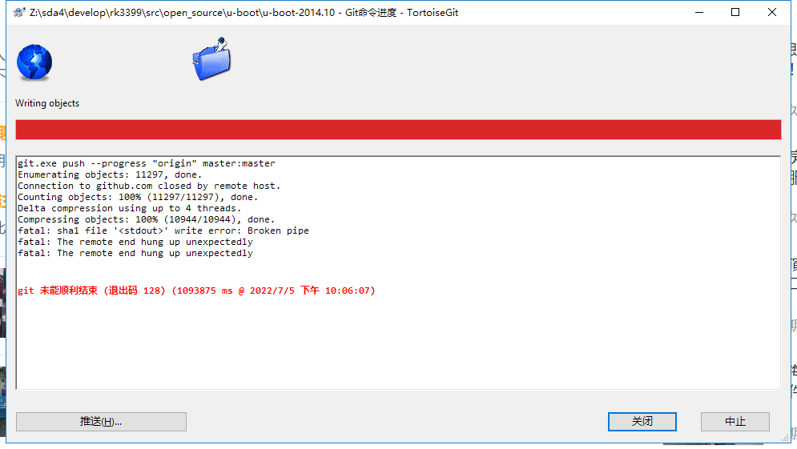

# 常见问题

## 上传失败截图

未使用“加速器”



```shell
git.exe push --progress "origin" master:master
Enumerating objects: 11297, done.
Connection to github.com closed by remote host.
Counting objects: 100% (11297/11297), done.
Delta compression using up to 4 threads.
Compressing objects: 100% (10944/10944), done.
fatal: sha1 file '<stdout>' write error: Broken pipe
fatal: The remote end hung up unexpectedly
fatal: The remote end hung up unexpectedly


git 未能顺利结束 (退出码 128) (734953 ms @ 2022/7/5 上午 12:15:39)
```

### 解决办法：

在ubuntu下修改sshd_config后push正常

```
vim ~/.ssh/sshd_config
```

> ClientAliveInterval 120 
> ClientAliveCountMax 720

第一行，表示**每隔120秒向客户端发送一个“空包”**，以保持于客户端的连接。

第二行，表示**总共发送720次“空包”**，之后断开它们之间的连接，也就是：`120秒 × 720 = 86400 秒 = 24小时` 后。

**说明：**win10下修改C:\Users\Administrator\\.ssh\sshd_config后无用
