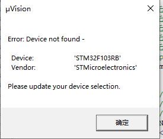

[TOC]

### keil5下keil4支持包

官网：https://www2.keil.com/mdk5/legacy/

csdn: https://download.csdn.net/download/it_660/13762254

> 官网下载过慢，可在csdn下载

### .uvprojx在keil5下打开时弹出"error:not found device"问题

**问题截图**

**解决办法**

安装keil4支持包

> ​	参考本文：keil5下keil4支持包