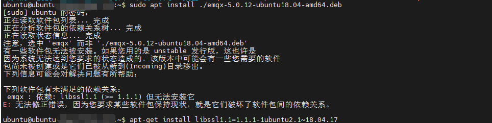
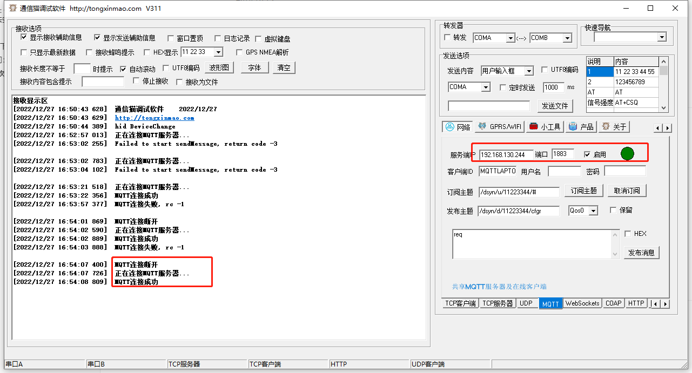

# 遇到的坑：

### emqx : 依赖: libssl1.1 (>= 1.1.1) 但无法安装它

解决办法：

> wget http://archive.ubuntu.com/ubuntu/pool/main/o/openssl/libssl1.1_1.1.1f-1ubuntu2_amd64.deb
>
> sudo dpkg -i libssl1.1_1.1.1f-1ubuntu2_amd64.deb

# 参考教程：

## [mqtt服务器搭建（ubuntu）](https://blog.csdn.net/qq_37733540/article/details/112062077)

# emqx安装

> sudo apt install ./emqx-5.0.12-ubuntu18.04-amd64.deb
>
> emqx start

#### deb下载链接：

https://www.emqx.io/zh/downloads?os=Ubuntu

#### 访问：

> http://192.168.130.244:18083/
>
> admin / public  //默认账号密码，第一次登录时会强制修改，当前修改为admin/admin

# mqtt测试软件：通信猫软件

下载链接：

> http://www.tongxinmao.com/App/Detail/id/126

服务器：192.168.130.244

端口：1883

# mqtt实例

## [Qt开发MQTT（一） 之Qt官方Qt MQTT](https://blog.csdn.net/luoyayun361/article/details/104671603)

## [Qt加载MQTT库的方法，以及实现MQTT通信的例子（发布订阅均测试成功）](https://blog.csdn.net/qq_40754866/article/details/105630734)