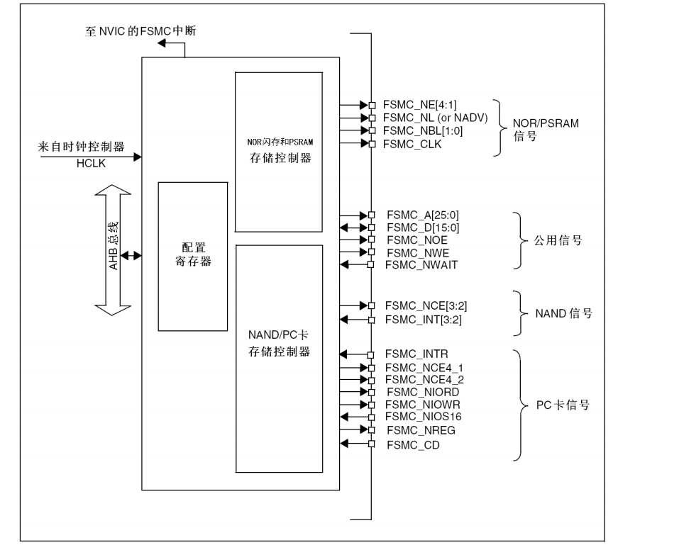

[TOC]

# 常见嵌入式相关术语

## RCC(RESET and clock control)

## 静态存储器控制器（FSMC）

CPU内置灵活的静态存储器控制器（FSMC），可以外扩总线型的存储器（如SRAM、NOR Flash）。

> FSMC的英文全称为“Flexible static memory controller”，多见于STM32的芯片
>
> 所有的外部存储器共享控制器输出的地址、数据和控制信号，每个外部设备可以通过一个唯一的片选
>
> 信号加以区分。FSMC在任一时刻只访问一个外部设备。

内部框图

