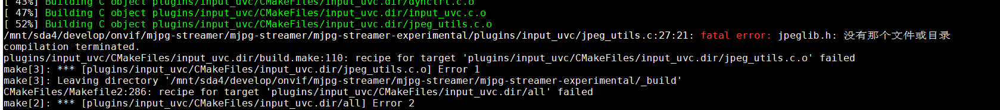

## x86环境(ubuntu16.04)安装mjpg-streamer

```shell
cd /mnt/sda4/develop/onvif
cd mjpg-streamer/
git clone https://gitee.com/bozen021/mjpg-streamer.git
cd mjpg-streamer/mjpg-streamer-experimental/
make all
sudo make install
./start.sh
```

## arm环境(raspberry)安装mjpg-streamer

```
su lj
```

## pc上访问：

http://192.168.1.100:8080/stream.html

http://192.168.1.102:8080/stream.html

## 踩坑记录

#### mjpg-streamer-experimental/plugins/input_uvc/jpeg_utils.c:27:21: fatal error: jpeglib.h: 没有那个文件或目录



解决办法：

```
sudo apt install libjpeg-turbo8-dev
```

