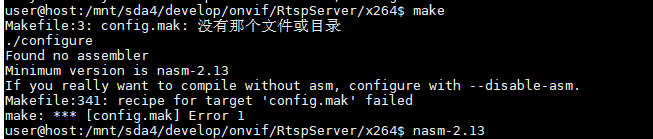
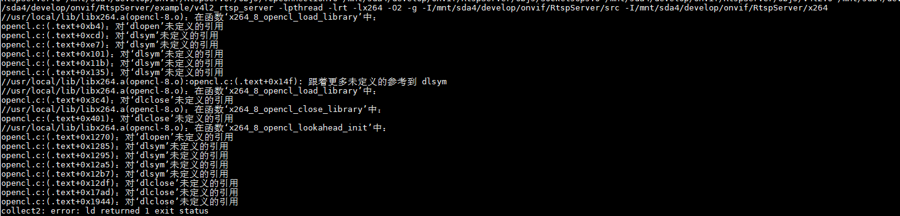

# RspServer

## 使用指导：

​	[我的开源项目-RtspServer](https://dandelioncloud.cn/article/details/1456770820562571266)

​	对应github链接：https://github.com/ImSjt/RtspServer

## arm下安装过程

```
cd /home/pi/onvif
git clone https://gitee.com/yeahtoo/RtspServer
cd RtspServer
make

git clone https://gitee.com/bruce_dong/x264
cd x264
chmod 777 configure ./config.guess ./config.sub ./tools/cltostr.sh 

```


## x86下安装过程

#### 代码下载及编译

```
cd /mnt/sda4/develop/onvif/
git clone https://gitee.com/yeahtoo/RtspServer
cd RtspServer

cp x264/libx264.a ./
make

```

## 修改支持v4l2

```shell
vim Makefile
修改前：
	V4L2_SUPPORT=n
修改后：
	V4L2_SUPPORT=y
```

### 安装依赖库x264

https://www.videolan.org/developers/x264.html

```
git clone https://gitee.com/bruce_dong/x264
cd x264
chmod 777 configure ./config.guess ./config.sub ./tools/cltostr.sh 

增加-I路径 
-CXX_FLAGS      = -O2 -g -I$(TOR_DIR)/src
+CXX_FLAGS      = -O2 -g -I$(TOR_DIR)/src -I/mnt/sda4/develop/onvif/RtspServer/x264
```


### 踩过的坑：

#### nasm版本不对



解决办法：

```
方式一：
sudo apt install nasm     //此时可能安装的版本不对，需要使用方式二，源码安装nasm

方式二：
wget https://www.nasm.us/pub/nasm/releasebuilds/2.14/nasm-2.14.tar.gz
tar xzf nasm-2.14.tar.gz
cd nasm-2.14/
./configure
make
sudo make install

user@host:/mnt/sda4/develop/onvif/RtspServer/x264/nasm-2.14$ nasm -version  //make install 后显示版本
NASM version 2.14 compiled on Aug  7 2022
user@host:/mnt/sda4/develop/onvif/RtspServer/x264/nasm-2.14$
```

#### X264_VERSION宏未定义

x264.c:506:21: error: ‘X264_VERSION’ undeclared (first use in this function)

解决办法：直接增加宏，但正常不应这么 解

```
vim x264_config.h
增加宏定义：
#define X264_VERSION "r5"
```

#### dl库未链接

//usr/local/lib/libx264.a(opencl-8.o)：在函数‘x264_8_opencl_load_library’中：



解决办法：

​	在g++编译选项后面,加入dl的库,选项为-ldl,即可

​	

## 播放测试

```shell
cd /mnt/sda4/develop/onvif/RtspServer
./example/v4l2_rtsp_server /dev/video0
```

**vlc下验证通过，potplayer有问题**

​		rtsp://192.168.1.102:8554/live

ps:	ubuntu插入的是usb摄像头

# v4l2rtspserver


rtsp://192.168.1.102:8554/unicast


rtsp://192.168.1.120/xstrive0